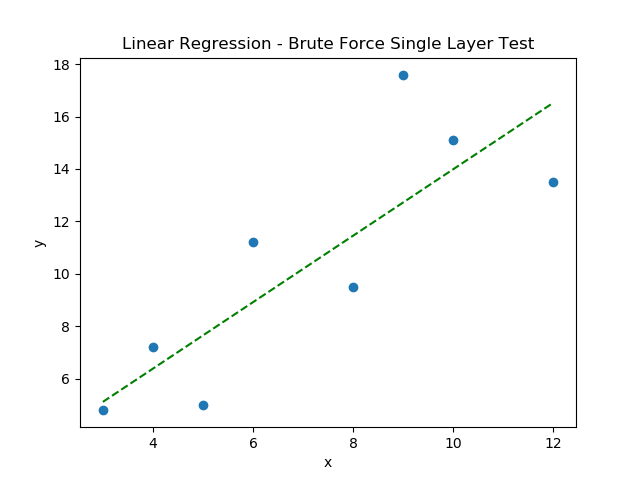
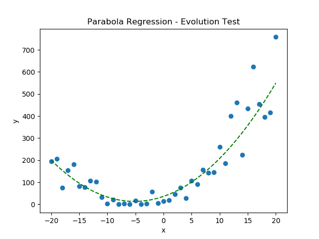
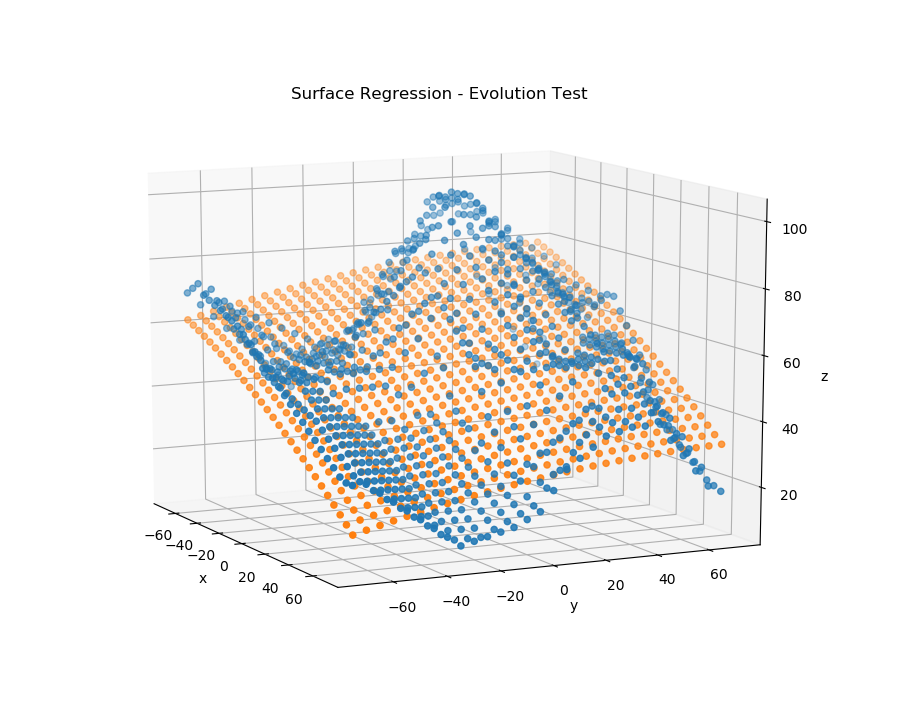

# Evogression

Evogression is Python package providing an evolutionary algorithm to develop a regression function for a target parameter.  An arbitrary number of input parameters can be used, and data samples need not have all parameters populated to be used in training the regression.

# Current Features

  - EvogressionCreature class provides randomized regression functions given a parameter dictionary.  These "creatures" can each predict an output value given an input parameter dictionary either from training data or for new predictions.
  - CreatureEvolution class creates a framework for evolving groups of creatures.  This class is designed to be subclassed into more specific evolution algorithms.
  - The Standardizer class is used to standardize input data.  This allows for regression parameters that estimate and evolve efficiently regardless of data scaling.

  - The goal of the subclasses/evolution algorithms is to generate a group of creatures which then compete to most accurately model the training data.  Creatures are rewarded when they are better at modeling results than their peers, and a survival-of-the-fittest situation emerges.  Creatures may be "mated" with resulting offspring having a combination of the parent creatures' regression characteristics along with some mutation.
  - CreatureEvolutionFittest evolves creatures by killing off the worst performers in each cycle and then randomly generating many new creatures.
  - CreatureEvolutionNatural evolves creatures by "feeding" them.  The better creatures successfully model test data and stay healthy while bad performers get progressively "hungrier" until they are killed off. Cycles of "feast" and "famine" cause the community of creatures to grow and shrink with each phase either increasing the diversity of creatures (regression equations) or decreasing the diversity by killing off the lower-performing creatures.

  - evolution_group.py provides high-level approaches to regression by running multiple evolution groups.
  - Parameter pruning algorithm can determine the most useful attributes in a dataset and progressivly discard the least useful data while progressively determining a best fit equation for the target attribute.

# Testing

  - Brute force generation of creatures successfully models linear and parabolic 2D data.

  - Evolution algorithm successfully models linear and parabolic 2D data.

 - Evolution algorithm successfully uses a surface to approximate 3D data using two input attributes.  This illustrates how Evogression can successfully model multivariate relationships.

License
----
TODO
