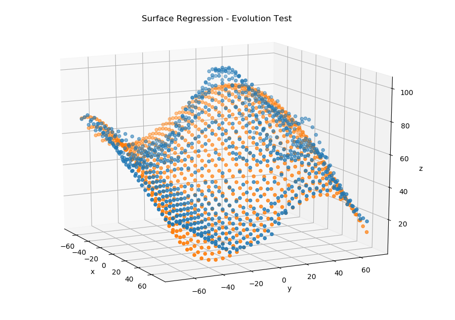
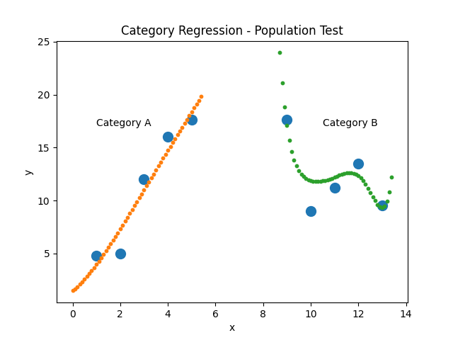

# Evogression

Evogression is a Python package providing an evolutionary algorithm to develop a regression function for a target parameter.  An arbitrary number of input parameters can be used, and data samples need not have all parameters populated to be used in training the regression.

As of version 0.7.0, the core calculations are rewritten in Rust for much improved performance (~10x) compared to the previous Cython design.

# Quickstart

  - Use pip to install Evogression
    ```
    pip install evogression
    ```

  - Format your input data as a list of dictionaries.
  - Run the following to generate a regression function and then output this function as a python module:
    ```
    import evogression

    evolution = evogression.Evolution('target_variable_key', data, num_creatures=10000, num_cycles=10)
    evolution.output_best_regression()
    ```
  - At this point, there will be a "regression_function.py" file within a newly-created "regression_modules" directory.  The "regression" function within this Python module can be imported and used with a dictionary of inputs to generate an estimated output value.

# Current Features

  - The goal of the evolution algorithm is to generate a group of "creatures" (each a unique regression function) which then compete to most accurately model the training data.  Creatures are saved when they are better at modeling results than their peers, and a survival-of-the-fittest situation emerges.  Creatures mutate individually and with other creatures to search for better solutions.

  - groups.py provides high-level approaches to regression by running multiple evolution groups.
  - Parameter pruning algorithm can determine the most useful attributes in a dataset and progressively discard the least useful data while determining a best fit equation for the target attribute.

# Testing

  - Brute force generation of creatures successfully models linear and parabolic 2D data.


  - Evolution algorithm successfully models linear and parabolic 2D data.


 - Evolution algorithm successfully uses a surface to approximate 3D data using two input attributes; this illustrates how multivariate relationships can be modeled.  While the case of two inputs is visualized below, any number of input attributes can be used to build a regression function.




 - A "Population" can develop separate prediction models for data separated into different categories.

 


License
----
MIT
